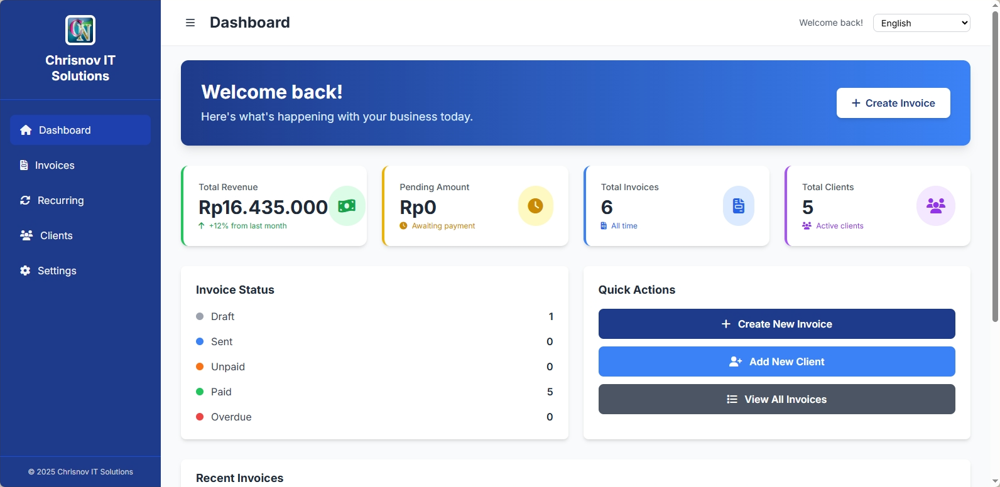

# Chrisnov Invoice

**Chrisnov Invoice** is a modern, open-source invoicing application designed for freelancers and small businesses. Built with Python and Flask, it provides a user-friendly web interface to manage clients, create professional invoices, and streamline your billing process.



## ✨ Key Features

### Core Functionality

- **Client Management**: Easily add, edit, and organize your client details.
- **Invoice Creation**: Generate professional invoices with custom line items, taxes, and notes.
- **PDF Generation**: Create and download beautiful, print-ready PDF invoices.
- **Email Invoices**: Send invoices directly to your clients from the application.
- **Dashboard**: Get a quick overview of your business with key financial metrics.

### Advanced Features

- **Customizable PDF Templates**: Choose from multiple professional templates (Modern, Classic, etc.) and customize colors to match your brand.
- **Logo Upload**: Easily upload your company logo to be displayed on all invoices.
- **Multi-Currency Support**: Invoice clients in different currencies (USD, EUR, IDR, and more).
- **Flexible Tax Rates**: Set a default tax rate and override it on a per-invoice basis.
- **Status Tracking**: Keep track of invoice statuses (Draft, Unpaid, Paid, Overdue).
- **Responsive Design**: Access and manage your invoices on any device—desktop, tablet, or mobile.
- **Internationalization (i18n)**: Fully supported English and Bahasa Indonesia interface, with persistent language selection.
- **Search and Filter**: Quickly find invoices or clients with powerful search and filtering capabilities.

## 🚀 Getting Started

### Prerequisites

- Python 3.8+
- Pip (Python Package Manager)

### Installation

1. **Clone the repository**:

   ```bash
   git clone https://github.com/rebarakaz/chrisnov-invoice.git
   cd chrisnov-invoice
   ```

2. **Create a virtual environment**:

   ```bash
   python -m venv venv
   source venv/bin/activate  # On Windows, use `venv\Scripts\activate`
   ```

3. **Install dependencies**:

   ```bash
   pip install -r requirements.txt
   ```

4. **Run the application**:
   - **Web Mode** (Standard):
     ```bash
     python run.py
     ```
   - **Desktop Mode** (Independent window):
     ```bash
     python run_desktop.py
     ```

### 📦 Building for Windows (.exe)
To create a standalone executable for Windows (no Python required for users):
```bash
python build_exe.py
```
After building, find your app in the `dist/ChrisnovInvoice` folder.

5. **Access the application**:
   Open your web browser and navigate to `http://127.0.0.1:5000`.

## ⚙️ Configuration

All major configuration can be done through the web interface in the **Settings** section.

### Business Information

- **Path**: `Settings` → `Business`
- **Actions**:
  - Set your business name, address, and contact details.
  - Upload or remove your company logo.
  - Set a default tax rate and currency.

### PDF Templates

- **Path**: `Settings` → `PDF Templates`
- **Actions**:
  - Choose a template style (e.g., Professional, Modern).
  - Customize the header and accent colors.
  - Adjust the logo position and visibility.
  - Define custom footer text for your invoices.

### Email (SMTP)

- **Path**: `Settings` → `Email`
- **Actions**:
  - Configure your SMTP server to send emails.
  - Supports standard SMTP, Gmail, Outlook, etc.
  - A built-in test function to verify your settings.

### Currencies

- **Path**: `Settings` → `Currencies`
- **Actions**:
  - Set the default currency for new invoices.
  - The list of supported currencies can be extended in `config.py`.

## 📖 Project Structure

```text
chrisnov-invoice/
├── app/
│   ├── models/         # SQLAlchemy database models
│   ├── routes/         # Flask route blueprints for each feature
│   ├── services/       # Business logic (PDF generation, email)
│   ├── static/         # CSS, JavaScript, and images
│   └── templates/      # Jinja2 HTML templates
├── docs/               # Markdown documentation files
├── instance/           # SQLite database file
├── venv/               # Python virtual environment
├── config.py           # Application configuration
├── requirements.txt    # Python dependencies
└── run.py              # Application entry point
```

## 🤝 Contributing

Contributions are welcome! If you have ideas for new features, bug fixes, or improvements, please feel free to open an issue or submit a pull request.

1. Fork the repository.
2. Create a new branch (`git checkout -b feature/your-feature-name`).
3. Make your changes.
4. Commit your changes (`git commit -m 'Add some feature'`).
5. Push to the branch (`git push origin feature/your-feature-name`).
6. Open a pull request.

## 📚 Documentation

For more detailed information on specific features, please refer to the following guides:

- [Business Settings](docs/BUSINESS_SETTINGS_GUIDE.md): How to configure your brand and business data.
- [PDF Templates](docs/PDF_TEMPLATES_GUIDE.md): Customizing the look and feel of your invoices.
- [Email Settings](docs/EMAIL_SETTINGS_GUIDE.md): Setting up SMTP for direct invoice delivery.
- [Currency Settings](docs/CURRENCY_SETTINGS_GUIDE.md): Managing multiple currencies and rounding.

## 📜 Changelog

Stay up-to-date with the latest features, improvements, and bug fixes by checking the [CHANGELOG.md](CHANGELOG.md).

## �️ Roadmap

We have big plans for the future! Check out our [ROADMAP.md](ROADMAP.md) to see what's coming next, including automated reminders, interactive dashboards, and client portals.

## �📄 License

This project is licensed under the MIT License. See the [LICENSE](LICENSE) file for details.
